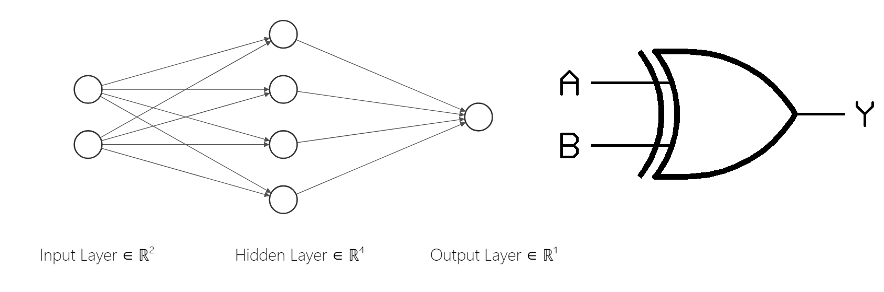
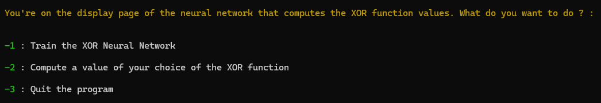
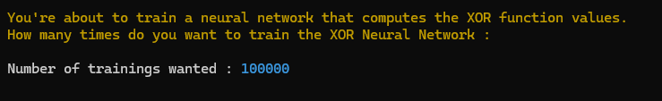
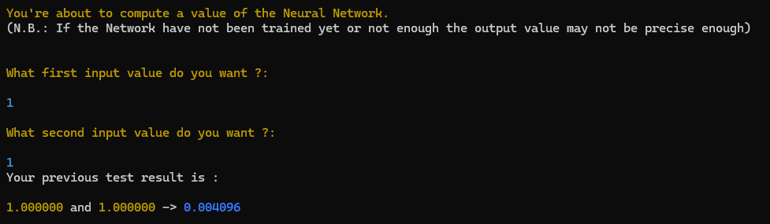

# XOR-ANN-from-scratch
**XOR prediction value using Artificial Neural Network - Coded from scratch - Using C language - Coded in 2021** 

This project is a first initiation to the Deep Learning field using the programmation language C. The aim of this project is to develop and train an ANN so it can be able to predict the output value of the XOR logic gate with two input values

Commmand to execute the code (project includes a Makefile): 
```bash
make clean

make

./main
```

The structure of the ANN is the following


The values of the XOR logic gate are the following: 
| Input A | Input B | Output (XOR) |
|---------|---------|--------------|
|    0    |    0    |      0       |
|    0    |    1    |      1       |
|    1    |    0    |      1       |
|    1    |    1    |      0       |

This means that for the ANN, 0 and 0 should give a result approaching 0, 0 and 1 a result approaching 1, and so on...


The instructions when running the code



You can first train the ANN as many time as you want 



Then you can compute a specific value for the XOR logic gate 



Knowledge used to build this project : 
###### https://towardsdatascience.com/part-2-gradient-descent-and-backpropagation-bf90932c066a
###### https://www.youtube.com/watch?v=aircAruvnKk&list=PLZHQObOWTQDNU6R1_67000Dx_ZCJB-3pi

